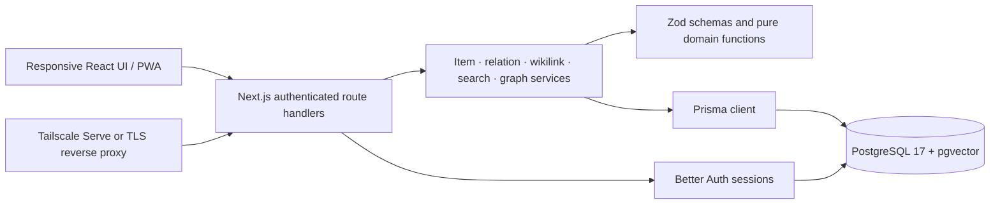
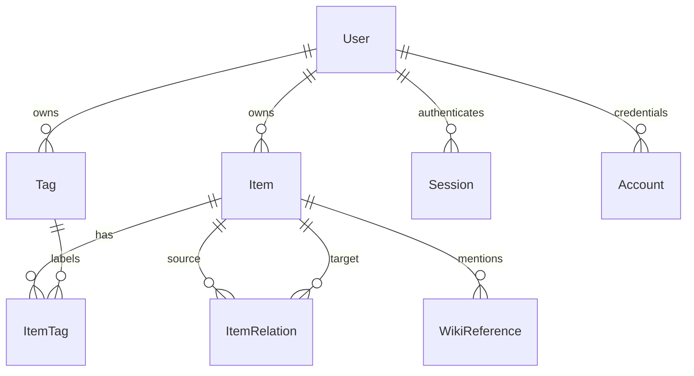

# Synapse architecture

Synapse is a modular TypeScript monolith backed by PostgreSQL. One web process and one database keep operations reasonable on a Raspberry Pi 5. V1 has one deployment owner, while every private entity and query carries a user boundary for future independent accounts. Collaboration is not implemented.

## Boundaries

- `src/app`: page/layout composition, protected workspace routes, public login/health, and HTTP adapters.
- `src/components` and `src/features`: forms, Markdown, navigation, command palette, graph canvas, and presentation state.
- `src/domain`: shared types, input schemas, normalized identities, and code-aware wikilink parsing.
- `src/server`: ownership checks, transactions, use cases, query composition, and safe HTTP errors.
- `src/lib`: singleton Prisma client and Better Auth configuration.
- `prisma`: declarative relations plus reviewed SQL for PostgreSQL-specific search and constraints.

Server Components protect/combine routes; interactive editors, dialogs, and the canvas are Client Components. Route handlers authenticate and validate requests before calling services. Business rules belong in services/domain functions, not duplicated in component event handlers. Shared DTOs cross the serialization boundary; database models and secrets stay on the server.

## Domain and persistence

An **Item** has a stable ID, owner, type, title, Markdown content, workflow status, inbox state, optional bookmark URL/due date, completion/archive timestamps, optimistic-concurrency version, and timestamps. Types are `NOTE`, `TASK`, `PROJECT`, `AREA`, `RESOURCE`, and `BOOKMARK`. A task is not a disconnected table; it can be searched, linked, tagged, and graphed like a note.

Titles and tags use Unicode NFKC normalization, trimmed/collapsed whitespace, and case-insensitive identity. Titles are unique per owner after normalization so `[[PostgreSQL]]` resolves deterministically. Item IDs remain the durable relation key. Tags are relational entities with an owner-scoped unique normalized name, connected through `ItemTag`.

Composite foreign keys `(userId, itemId)` ensure a relation or tag assignment cannot cross owners even if application checks regress. Unique constraints prevent duplicate directed relations of the same type. A SQL check rejects self-relations. Cascading deletion removes joins and connected edges; it never deletes the other connected Item.

## Capture, PARA, tasks, and archive

Capture creates an inbox Item with minimal required metadata. Processing assigns type/tags/parent relations and clears `inbox`. A Project represents an outcome, an Area an ongoing responsibility, and a Resource reference knowledge. Parent assignments are `PARENT` edges directed **child → parent**. The reverse view supplies children; a redundant `CHILD` record is unnecessary.

Status and archive are independent. `TODO`, `IN_PROGRESS`, `DONE`, `ON_HOLD`, `CANCELLED`, and `ACTIVE` cover lightweight task/project workflows; `completedAt` follows completion. Archiving sets `archivedAt`; content and links remain stored. Restore clears it. Permanent deletion requires the explicit UI/API confirmation and ownership checks. Search includes archives by default; graph defaults to active Items and can include archived Items.

Version checks detect stale saves, and transactional mutations keep item data, tags, relationships, and derived wikilinks consistent. A conflicting write returns a recoverable conflict rather than silently losing another editor's changes.

## Relations and backlinks

`ItemRelation` stores one directed edge with `RELATED`, `PARENT`, or `REFERENCES` type. Indexed source and target columns support outgoing links and backlinks. Backlinks are an incoming query, not a duplicated reverse row. Every endpoint scopes both source and target to the authenticated owner.

Manual reference edges and Markdown-derived reference edges can coincide. The `manual` and `wikilink` flags preserve that provenance on one unique row. Removing a wikilink clears the derived flag; a separately added manual relation survives. Repeated saves upsert the same edge.

## Wikilinks

The pure parser recognizes `[[Title]]` and `[[Title|label]]` in prose, ignores escaped links and code examples, and normalizes the target title. `WikiReference` stores mentions, including unresolved ones. Within the save transaction, matching Items become `REFERENCES` edges and obsolete derived edges are removed.

Creating an Item resolves waiting references to its title. Renaming a target rewrites recognized references in source Markdown, preserving aliases and bumping source versions; this keeps text and edges consistent. Deleted targets leave useful unresolved mentions, which can be recreated through the editor workflow. An archive operation does not break links.

Rendering turns resolved links into internal Item URLs and unresolved links into a create workflow. Markdown is parsed as Markdown, sanitized, and rendered through React; raw HTML is not trusted. The preview never treats stored content as application JavaScript.

## Search

PostgreSQL maintains a weighted title/content `tsvector` with a GIN index. Search uses the `simple` dictionary so technical names and mixed-language notes are not forced through English stemming. A single word supports token-prefix matching; multiple terms use `websearch_to_tsquery`. Tags participate through relational tag joins and PostgreSQL text search. Results include type, plain-text context, tags, and archive state.

All raw SQL is constructed using parameterized Prisma SQL fragments, including the authenticated user ID. Type/tag/archive filters run server-side. Results are ranked with title preference and full-text rank, with stable secondary ordering; pagination returns up to 50 hits per request. Snippets are plain text, never raw `ts_headline` HTML.

The command palette exposes this API globally with `Ctrl/Cmd + K` and keyboard navigation. Search is lexical, not semantic: no embeddings or vector database exists in V1.

## Graph

The graph is a bounded projection of authorized Items and relations, not a second database. The server selects filtered nodes then edges with **both endpoints inside the returned node set**. A local view uses the current Item and one-hop incoming/outgoing neighbors. The response reports truncation. Nodes include summary metadata; full content is loaded only when needed for details.

The default renderer is `react-force-graph-3d` 1.29.1 with Three.js 0.186.0: a WebGL scene with a force-directed layout in three dimensions and an orbitable camera. Cytoscape.js 3.34.3 remains an optional 2D view and the automatic fallback when WebGL is unavailable. React owns shared filters, selection, controls, and the selected-node details panel. Type shapes and a legend supplement color; small graphs show labels throughout, while larger graphs label selected or hovered nodes. Keyboard camera controls and a companion item list provide access beyond pointer gestures.

Both renderers use the same query service and ownership rules: 500 nodes by default, at most 1,500 nodes and 5,000 edges. Physics runs are bounded; renderer-owned mutable objects stay separate from API data, and GPU resources/Cytoscape instances are released when no longer needed. Moving to 3D requires no data or database changes. See [graph design, controls, and limits](docs/graph.md).

## Authentication and authorization

Better Auth uses the Prisma adapter for users/accounts/sessions, its built-in password hashing, HTTP-only session cookies, and database-backed rate limiting. Public signup is disabled. Bootstrap creates the first account from deployment variables once; it never resets existing credentials. Production requires a random secret and HTTPS for external origins. Logout invalidates the session.

Protected layouts improve navigation, but services/routes independently enforce session and ownership checks. JSON mutations validate origin/fetch metadata and require JSON content; Better Auth applies its own auth endpoint protections. Private responses are not cached. Errors expose concise safe messages; unexpected-error logs omit credentials and note bodies. See [security](docs/security.md).

## Production architecture

The multi-stage Dockerfile builds standalone Next.js output and runs under UID 1001 on Node 22 Debian Bookworm with OpenSSL. Production dependencies deliberately include Prisma CLI and `tsx` for startup migrations/bootstrap. Generated engine files are explicitly retained rather than relying only on output tracing. Static/public assets accompany the standalone server, as required by [Next.js output tracing](https://nextjs.org/docs/app/api-reference/config/next-config-js/output).

Compose defines `secondbrain-web` and `secondbrain-db`. Only web is published, to loopback by default. The database uses a named persistent volume and a readiness check; web waits for healthy PostgreSQL and exits on failed migration/bootstrap. Native `pg_dump`/`pg_restore` scripts provide real recovery independently of the volume. Tailscale Serve or another host TLS proxy supplies HTTPS.

## Future extension points

- **AI/RAG:** add an ingestion boundary downstream of committed Item versions, with an outbox/job table if asynchronous processing becomes necessary. Index owner IDs, item IDs, content versions, and deletion/archive state. Retrieval must recheck authorization against live Items and cite source IDs. No AI integration is active today.
- **Object storage:** Attachment metadata and private local storage are implemented. StorageProvider is the extension boundary for a future S3/MinIO provider; ownership checks and compensation stay in the attachment service.
- **Larger graphs:** cursor/neighborhood expansion, server-side clustering, cached layouts, and background layout workers can extend the current bounded projection.
- **Additional independent users:** existing owner boundaries support separate private spaces; invitations, account management, and quotas still need implementation. Shared workspaces would require explicit permissions, not removal of owner filters.

## Universal Capture and private attachments

Capture accepts JSON or bounded multipart requests. The attachment service validates media, stages opaque files, commits metadata and item relations in a per-user transaction, and compensates failed creation. AttachmentDeletion durably records pending filesystem deletions. The non-root web container owns a separate attachment volume. Coordinated backup/restore verifies SHA-256 and swaps a staged objects directory while web is stopped. Item URLs use the centralized title-slug plus full stable ID helper; stale slugs redirect without changing identity.
