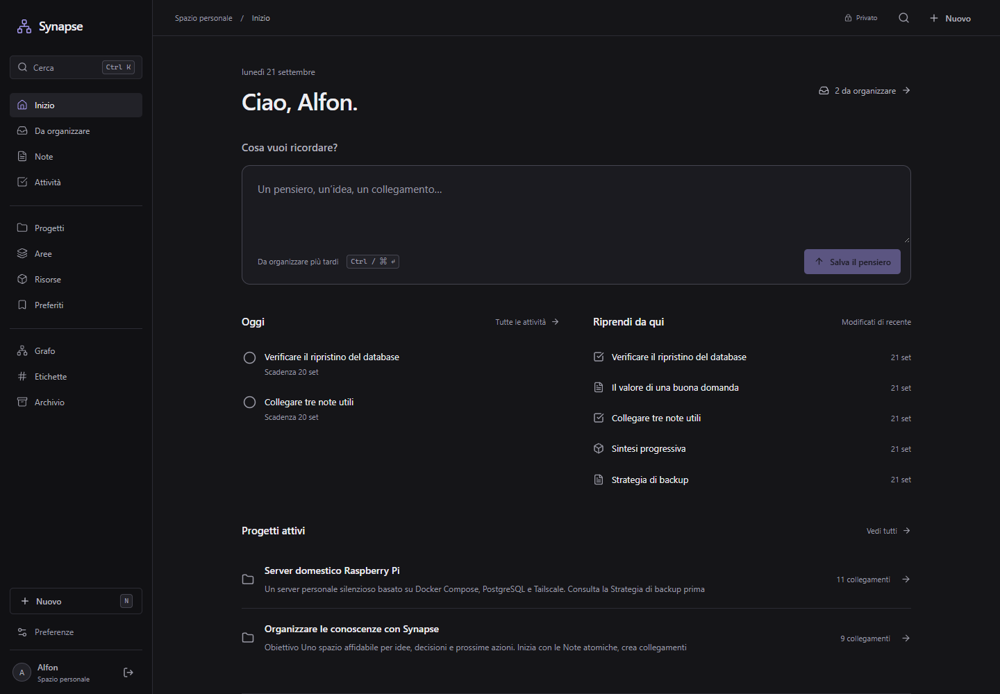
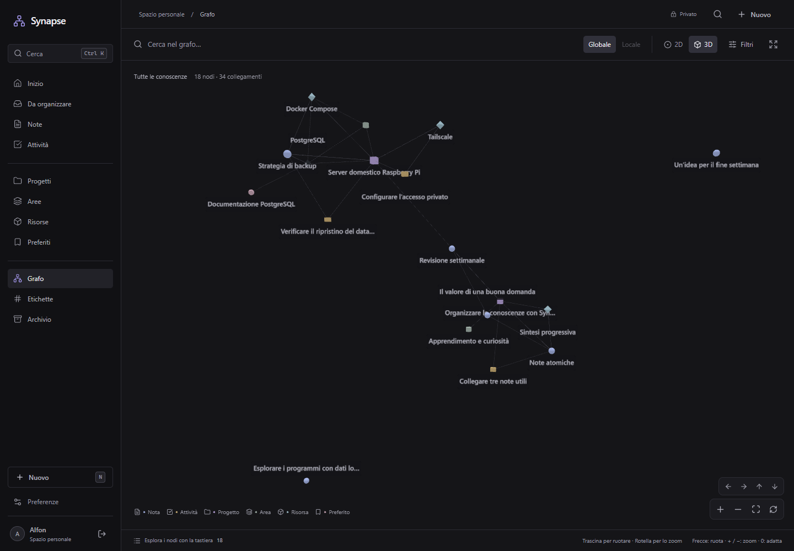
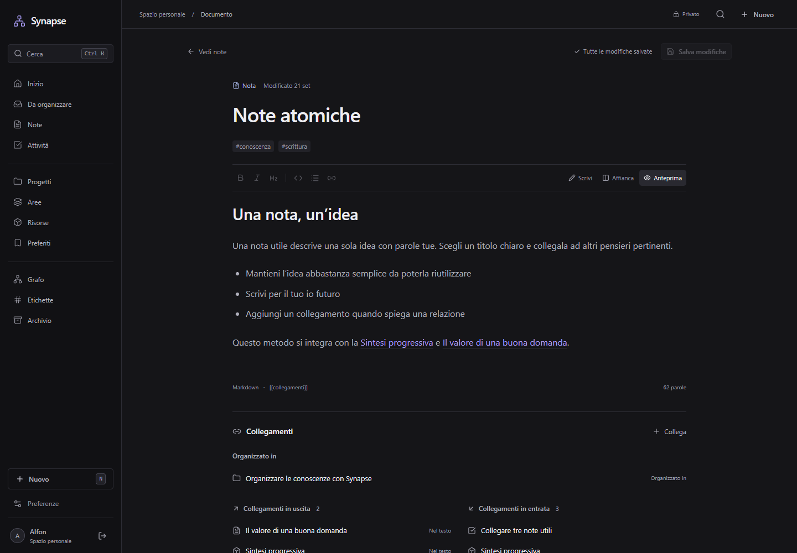
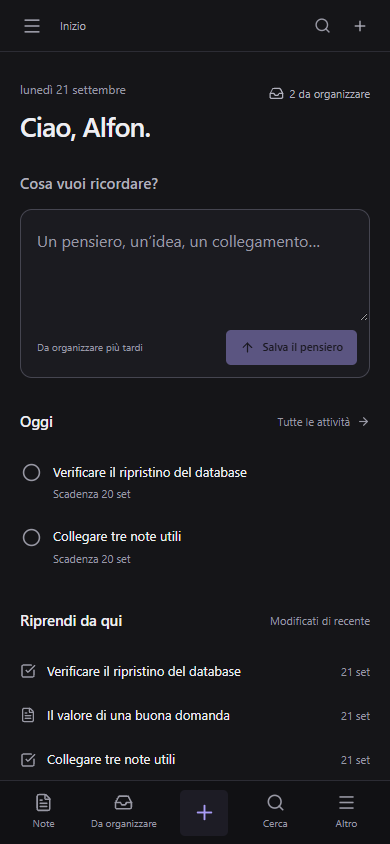

# Synapse

**Un posto per i tuoi pensieri. Uno spazio per collegarli.**

Raccogli idee, scrivi note e ritrova le connessioni tra ciò che impari.

[Funzionalità](#cosa-puoi-fare) · [Grafo delle conoscenze](#segui-il-filo-delle-tue-idee) · [Inizia](#il-tuo-spazio-le-tue-conoscenze)

Synapse è il tuo **secondo cervello personale**: uno spazio privato dove conservare appunti, progetti, risorse e cose da ricordare. Un’idea può diventare una nota, una nota può collegarsi a un progetto e un vecchio appunto può tornare utile quando meno te lo aspetti.

L’interfaccia lascia spazio ai contenuti: colori scuri neutri, controlli discreti e un ambiente pensato per leggere, scrivere ed esplorare.

## Cosa puoi fare

### Cattura un pensiero, organizzalo dopo

Salva **testo, link, immagini, audio e documenti** dalla Home o dalla cattura universale. Incolla uno screenshot, trascina un PDF o registra un memo vocale con pausa e anteprima. Il titolo è facoltativo: Synapse lo ricava dal contenuto.

Non devi decidere subito dove mettere tutto: la sezione **Da organizzare** raccoglie ciò che vuoi sistemare in un secondo momento. Premi **N** per catturare una nuova idea.

### Scrivi senza perdere il filo

Contenuto, collegamenti, attività e allegati hanno ciascuno il proprio spazio. Leggi una nota oppure passa all’editor Markdown, con anteprima e vista affiancata. Digita `[[` per collegare un’altra nota mentre scrivi: i collegamenti in entrata ti mostrano anche quali contenuti rimandano a quello che stai leggendo.

Le pagine hanno indirizzi leggibili che continuano a funzionare anche quando cambi titolo. I dettagli restano a lato sul desktop e si aprono quando servono sul telefono.

### Conserva anche ciò che non è testo

Allega immagini, PDF, documenti di testo e registrazioni alle tue idee. Guarda le immagini, ascolta i memo e scarica i file direttamente dalla nota. Puoi inserire un’immagine nel testo anche incollandola nell’editor.

Gli allegati sono **privati**, come le tue note, e vengono conservati sulla tua istanza. Dal telefono puoi scegliere una foto o usare la fotocamera; la registrazione vocale richiede un browser compatibile e una connessione sicura.

### Dai un posto a ciò che conta

| Contenuto     | Per cosa usarlo                                                |
| ------------- | -------------------------------------------------------------- |
| **Note**      | Idee, appunti, riflessioni e conoscenze da conservare.         |
| **Attività**  | Prossime azioni, scadenze e cose da completare.                |
| **Progetti**  | Obiettivi a cui collegare note, risorse e attività.            |
| **Aree**      | Ambiti continuativi della tua vita, dello studio o del lavoro. |
| **Risorse**   | Materiali e riferimenti da consultare nel tempo.               |
| **Preferiti** | Pagine e link da ritrovare insieme ai tuoi appunti.            |

Usa le **etichette** per attraversare queste categorie e l’**archivio** per conservare ciò che non ti serve nella vista quotidiana. Puoi ripristinarlo quando vuoi.

### Ritrova un’idea o passa subito all’azione

Apri la ricerca con **Ctrl / ⌘ K**. Cerca nei titoli e nei contenuti, torna ai documenti recenti oppure avvia un’azione, come creare una nota. Usa `#` per cercare etichette e `>` per trovare comandi.

## Segui il filo delle tue idee

Il **grafo delle conoscenze** rende visibili i collegamenti tra note, progetti e risorse. Ruotalo in 3D, avvicinati a un gruppo di idee o passa alla vista 2D.

- Esplora tutte le conoscenze oppure il **grafo locale** di un elemento, fino a tre livelli di collegamenti.
- Seleziona un nodo per evidenziare i suoi vicini e leggere i dettagli senza lasciare la vista.
- Restringi il campo con ricerca e filtri, adatta l’inquadratura o apri il grafo a schermo intero.
- Apri il documento collegato quando vuoi passare dall’esplorazione alla lettura.

## Dall’idea alla conoscenza

1. **Raccogli.** Un’intuizione, un link, un appunto preso al volo.
2. **Rielabora.** Aggiungi contesto e trasformalo in qualcosa di utile per te.
3. **Collega.** Associalo a un progetto, a un’area o a un’altra nota.
4. **Ritrova.** Riparti dalla ricerca, dai recenti o da una connessione nel grafo.

Puoi usarlo per studiare un argomento, raccogliere fonti per un progetto, documentare ciò che impari o tenere insieme idee e prossime azioni.

<strong>Uno sguardo alla lettura e all’interfaccia mobile</strong>

### Spazio alle note

### Le idee arrivano anche lontano dalla scrivania

L’interfaccia si adatta al telefono, con accesso rapido a note, raccolta e ricerca. Nei browser compatibili puoi installare Synapse come app. Per consultare e salvare i contenuti serve una connessione alla tua istanza.

## Il tuo spazio, le tue conoscenze

Synapse è **self-hosted**: lo installi su un computer o un server che controlli tu. Accedi al tuo spazio con un account privato e conservi lì le tue conoscenze.

L’interfaccia è in **italiano**, utilizzabile da tastiera e progettata per desktop e mobile. La versione attuale è dedicata all’uso personale: non include collaborazione, assistenti AI o sincronizzazione offline.

**Vuoi iniziare?** Segui la [guida all’installazione](docs/deployment.md). Per configurazione e sviluppo trovi tutto nella [guida tecnica](docs/technical-guide.md); per prenderti cura della tua istanza, consulta [backup e gestione](docs/operations.md).

---

**Synapse · Pensieri da conservare. Connessioni da riscoprire.**

[Segnala un problema o proponi un’idea](https://github.com/elfo399/Synapse/issues) · [Privacy e sicurezza](docs/security.md)

